# Auto Navbar Extension

A Quarto extension that automatically generates navigation bars based on file system structure, eliminating the need for manual navbar configuration.

## Features

- **Automatic Structure Detection**: Scans directory structure to infer navigation hierarchy
- **Smart Text Resolution**: Determines menu text from YAML metadata, special mappings, or filename inference
- **Flexible Configuration**: Supports custom mappings and level limits
- **Build-time Generation**: Creates navbars during Quarto build process
- **Path-based Targeting**: Different navbar configurations for different sections

## How It Works

The extension follows a systematic 7-step process to generate navigation bars:

```mermaid
flowchart TD
    A[📋 Parse Configuration] --> B[🔍 Scan Directory Structure]
    B --> C[🚫 Apply Exclusions]
    C --> D[🎯 Apply Special Mappings]
    D --> E[🌳 Build Hierarchy]
    E --> F[⚙️ Generate HTML]
    F --> G[💉 Inject via JavaScript]
    
    A --> A1[Extract YAML config<br/>Validate settings<br/>Determine scope]
    B --> B1[Recursive file scan<br/>Extract metadata<br/>Resolve paths]
    C --> C1[Filter excluded files<br/>Check mapping conflicts<br/>Log exclusions]
    D --> D1[Apply order values<br/>Override titles<br/>Track applications]
    E --> E1[Create tree structure<br/>Maintain relationships<br/>Handle nesting]
    F --> F1[Convert to HTML<br/>Apply Bootstrap classes<br/>Generate templates]
    G --> G1[Replace sidebar<br/>Inject JavaScript<br/>Ensure compatibility]
```



### The 7 Steps

1. **Configuration Parsing** - Extracts and validates the YAML configuration, determines the appropriate scope for the current page, and sets up logging levels for debugging.

2. **Directory Scanning** - Recursively scans the file system starting from the configured scope, discovers all `.qmd` files, extracts their metadata, and builds a comprehensive file inventory.

3. **Exclusion Processing** - Filters out files and directories that match exclusion patterns, ensuring they don't appear in the final navigation while checking for conflicts with special mappings.

4. **Special Mapping Application** - Applies custom title overrides and ordering values to specific files, using path-aware matching to ensure precise control over navigation appearance and structure.

5. **Hierarchy Construction** - Organizes the filtered and mapped files into a tree structure that preserves directory relationships, enabling nested navigation with proper parent-child associations.

6. **HTML Generation** - Converts the hierarchy into Quarto-compatible HTML using Bootstrap classes and accessibility attributes, creating collapsible sections and proper semantic markup.

7. **JavaScript Injection** - Injects the generated navbar into the document by replacing the existing sidebar element, ensuring seamless integration with Quarto's interface.

## Installation

The extension is already installed in this project. To install in other projects:

```bash
quarto add joncardoso/auto-navbar
```

## Configuration

### Basic Configuration

```yaml
filters:
  - auto-navbar

auto-navbar:
  "general":
    special-mappings:
      - path: "/"
        title: "🏠 Home"
      - path: "/syllabus.qmd"
        title: "📔 Syllabus"
  "/2024/winter-term/":
    levels: 3
    special-mappings:
      - path: "/week03/lab-solutions.qmd"
        title: "✅ Solutions"
```

### Configuration Structure

- **Path Keys**: Match URL paths to apply specific navbar configurations
- **Levels**: Limit the depth of directory scanning (optional)
- **Special Mappings**: Override automatic text resolution for specific files

### Text Resolution Priority

1. **Special Mappings**: Explicit title overrides
2. **YAML Metadata**: `title` field from `.qmd` file headers
3. **Smart Filename**: Intelligent filename → title conversion
4. **Fallback**: Cleaned filename

## Examples

### Term-specific Navigation

```yaml
auto-navbar:
  "/2024/autumn-term/":
    levels: 3
    special-mappings:
      - path: "/"
        title: "🏠 Home"
      - path: "/syllabus.qmd"
        title: "📓 Syllabus"
      - path: "/course-info.qmd"
        title: "ℹ Course Info"
```

### Section-specific Navigation

```yaml
auto-navbar:
  "/blog/":
    levels: 2
    special-mappings:
      - path: "/"
        title: "📰 Blog Home"
```

## Benefits

- ✅ **Automatic**: No manual navbar configuration needed
- ✅ **Maintainable**: Reflects actual file structure
- ✅ **Flexible**: Custom mappings for special cases
- ✅ **Consistent**: Same navbar across all pages in a section
- ✅ **Version Controlled**: Configuration lives with your content

## Development

To modify the extension:

1. Edit `_extensions/auto-navbar/auto-navbar.lua`
2. Update configuration in `_quarto.yml`
3. Rebuild with `quarto render`

## License

MIT License - see LICENSE file for details. 